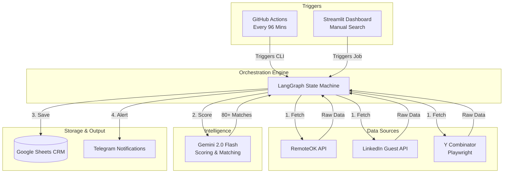
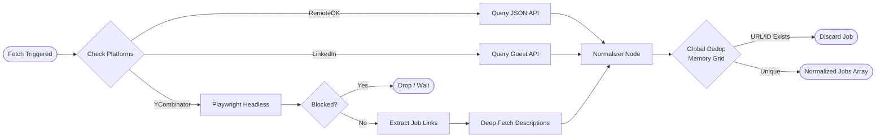
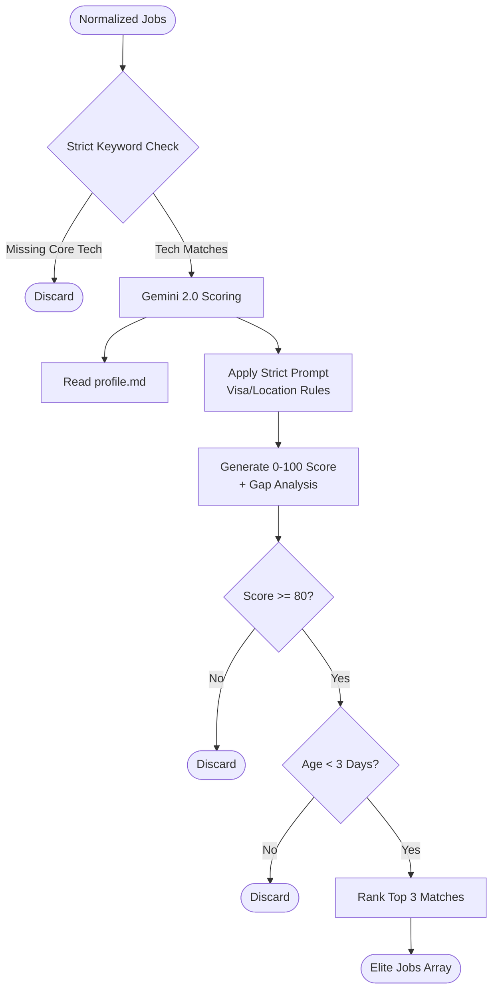
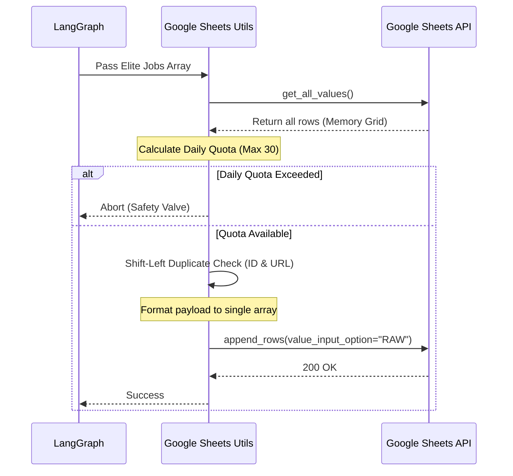
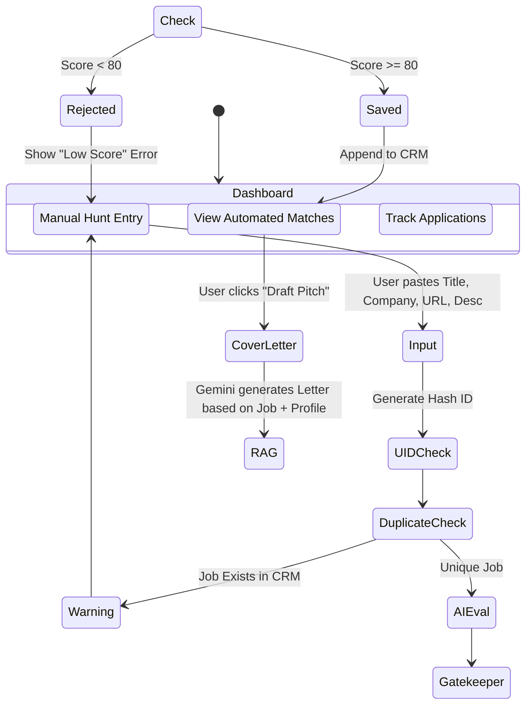

# 🏛️ HustleBot: System Architecture & User Flows

This document outlines the high-level architecture, module-specific user flows, and data pipelines for **HustleBot**. The system is divided into several autonomous modules orchestrated by LangGraph, operating continuously in the background, alongside a user-facing command center.

---

##  High-Level System Architecture

The macro-view of how HustleBot operates. It runs on a dual-trigger system: **Time-based** (GitHub Actions cron) and **User-initiated** (Streamlit UI).




##  Module 1: Job Discovery & Scraping Flow
This module is responsible for reaching out to various platforms, bypassing bot protections, and normalizing the disparate HTML/JSON into a standard Job object.


##  Module 2: AI Evaluation & Gatekeeper Flow
Once jobs are collected and normalized, they enter the intelligence pipeline. This flow ensures API costs are minimized by dropping bad jobs before they hit the LLM.


##  Module 3: Persistence & Database Flow
To prevent Google Sheets API rate-limiting (429 Quota Exceeded), this module handles the safe, bulk-insertion of jobs into the CRM.

##  Module 4: Dashboard & Manual Hunt Flow
The interactive user flow for the Streamlit dashboard. It allows the user to manually bypass the scrapers and inject a specific job directly into the AI evaluation pipeline.


##  Module 5: Telegram Notification Flow
The final step in the automated pipeline. It alerts the user immediately when a high-quality job is secured.

```mermaid
flowchart LR
    In([Elite Jobs Saved]) --> Loop[Iterate Top 3 Jobs]
    
    Loop --> Format[Format HTML Message]
    Format --> AddBadges{Score >= 90?}
    
    AddBadges -- Yes --> Unicorn[Add 🦄 Unicorn Badge]
    AddBadges -- No --> Standard[Add ✅ Standard Badge]
    
    Unicorn & Standard --> AddLink[Embed 'One-Click Apply' URL]
    AddLink --> API[POST /sendMessage]
    
    API --> Telegram((User Mobile App))
    API --> Sleep["time.sleep(1) to avoid API bans"]
    Sleep --> Loop

