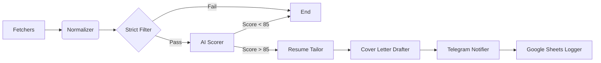

````markdown
# 🤖 HustleBot: Autonomous AI Recruiter

**HustleBot** is a fully autonomous AI agent that hunts for jobs 24/7. It scans multiple job boards, filters out irrelevant roles using strict criteria, scores matches using an LLM (Google Gemini), and auto-generates tailored resumes and cover letters for the top 1% of opportunities.


## ✨ Key Features

- **🕵️ Multi-Source Scraping:** Aggregates jobs from _RemoteOK_, _WeWorkRemotely_, and _Upwork_ (RSS).
- **🧠 Intelligent Scoring:** Uses **Google Gemini 2.0 Flash** to read job descriptions like a human recruiter.
  - _Rubric-based scoring (0-100)_ on Tech Stack, Experience, and Salary.
  - _Strict Filtering:_ Automatically rejects "Data Analyst" roles if you want "Python Developer".
- **👔 Resume Tailoring:** Rewrites your master `profile.md` for _every_ single high-quality match.
  - _Re-orders skills_ to match the JD.
  - _Adjusts summary_ to mirror the company's language.
- **✍️ Auto-Drafting:** Generates personalized cover letters ready for submission.
- **📱 Real-Time Alerts:** Sends instant Telegram notifications with "One-Click Apply" links.
- **📊 CRM Logging:** Logs every job found, scored, and applied to a **Google Sheet** for tracking.
- **☁️ 24/7 Automation:** Runs automatically via **GitHub Actions** (Cron Schedule).

---

## 🏗️ Architecture (LangGraph)

The agent operates as a directed graph state machine:


````

---

## 🚀 Getting Started

### 1. Prerequisites

- Python 3.10+
- Google Cloud API Key (for Gemini)
- Telegram Bot Token & Chat ID
- Google Service Account (for Sheets)

### 2. Installation

```bash
# Clone the repo
git clone [https://github.com/yourusername/hustle-bot.git](https://github.com/yourusername/hustle-bot.git)
cd hustle-bot

# Install dependencies
pip install -r requirements.txt

```

### 3. Configuration

Create a `.env` file in the root directory (or use the Dashboard UI to set these):

```ini
# --- Core AI ---
GOOGLE_API_KEY="AIzaSyD..."

# --- Notifications ---
TELEGRAM_BOT_TOKEN="123456:ABC-DEF..."
TELEGRAM_CHAT_ID="987654321"

# --- Storage ---
GOOGLE_SHEET_URL="[https://docs.google.com/spreadsheets/d/](https://docs.google.com/spreadsheets/d/)..."
# (Optional) If running locally, place credentials.json in root

```

### 4. Setup Your Profile

Edit the `profile.md` file in the root directory. This serves as the "Master Source" for the AI.

- _Tip: Be detailed! The AI subtracts from this file, it doesn't invent new skills._

---

## 🖥️ Usage

### Option A: The Dashboard (Interactive)

Best for manual searches, testing new keywords, and downloading resumes.

```bash
streamlit run dashboard.py

```

- **Run Agent:** Trigger a manual hunt.
- **Job Matches:** View a sorted table of opportunities.
- **Tailored Resumes:** Download the `.md` files generated for specific companies.

### Option B: Headless Mode (CLI)

Best for testing the backend logic without a UI.

```bash
python main.py

```

---

## ☁️ Deployment (GitHub Actions)

This repo includes a pre-configured workflow: `.github/workflows/daily_job_hunt.yml`.

1. Push code to GitHub.
2. Go to **Settings > Secrets and variables > Actions**.
3. Add the following Repository Secrets:

- `GOOGLE_API_KEY`
- `TELEGRAM_BOT_TOKEN`
- `TELEGRAM_CHAT_ID`
- `GOOGLE_SHEET_URL`
- `GOOGLE_SHEETS_JSON` (Content of your credentials.json)

4. The bot will now run automatically **every day at 8:00 AM UTC**.

---

## 📂 Project Structure

```
hustle-bot/
├── .github/workflows/   # CI/CD for Daily Hunt
├── generated_resumes/   # AI-tailored Markdown files
├── src/
│   ├── graph/           # LangGraph Workflow Logic
│   ├── llm/             # Gemini Prompts (Scoring, Tailoring)
│   ├── models/          # Data Classes
│   ├── notifications/   # Telegram Logic
│   ├── platforms/       # Scrapers (RemoteOK, WWR, Upwork)
│   └── utils/           # Google Sheets & File Helpers
├── dashboard.py         # Streamlit UI
├── main.py              # CLI Entry Point
├── profile.md           # Your Master Resume
└── requirements.txt     # Python Dependencies

```

## 🛡️ License

MIT License. Built for the Hustlers.

````

### Next Step
Since you are now "Open Source Ready," you might want to create a **`.gitignore`** file (if you haven't already) to prevent accidentally uploading your keys or junk files.

**File:** `.gitignore`
```text
__pycache__/
*.pyc
.env
user_settings.json
credentials.json
generated_resumes/
.DS_Store

````

This LangGraph tutorial helps you visualize the graph architecture you just documented [LangGraph Simplified: Master Custom AI Agent Creation](https://www.youtube.com/watch?v=R-o_a6dvzQM).

_Relevance: This video explains the exact "Nodes and Edges" concept you used in the Architecture section of your README._
